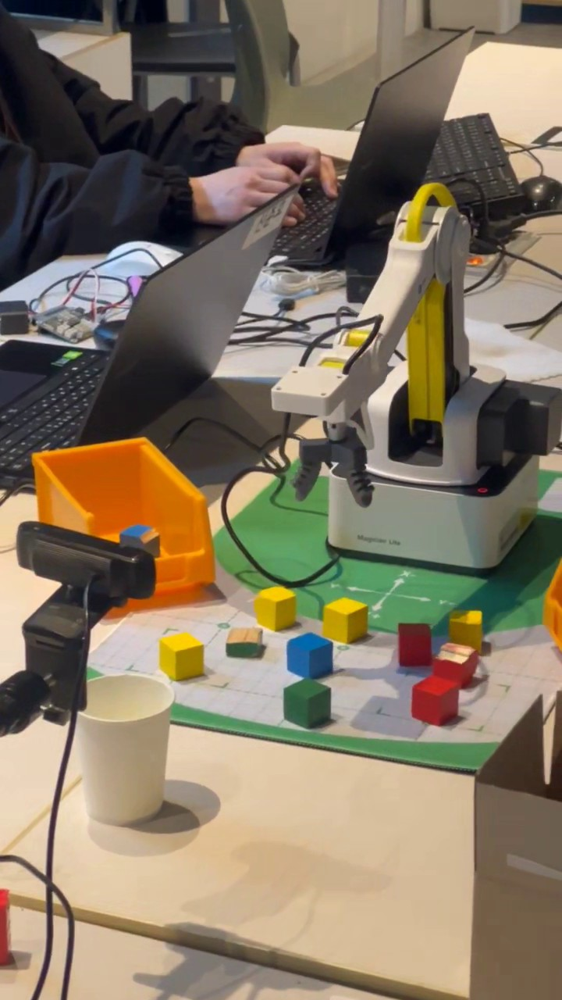
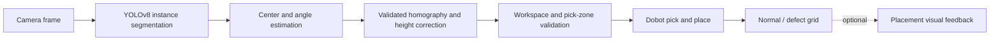

# Dobot Vision Sorter

[](https://github.com/spongebobDG/dobot-vision-sorter/actions/workflows/ci.yml)

YOLOv8 인스턴스 세그멘테이션과 카메라-로봇 좌표 보정을 이용해 정상/불량 블록을 분류하고 Dobot으로 자동 배치하는 비전 기반 로봇 시스템입니다.

> Portfolio release v1.0 · 실제 장비 데모, 재현 가능한 코드 구조, 안전 가드 및 CI 검증 완료

| 구분 | 내용 |
|---|---|
| 구성 | 개인 프로젝트 |
| 실기기 | Dobot Magician Lite, 고정 카메라, 공압 그리퍼 |
| 대표 증거 | 64.7초 pick-and-place 영상, 단위 테스트 12개, GitHub Actions |
| 포트폴리오 | [ROBOTIS 지원 포트폴리오 요약](https://github.com/spongebobDG/robotics-software-portfolio/blob/main/projects/dobot-vision-sorter.md) |

## At a glance

| Area | Implementation |
|---|---|
| Hardware | Dobot Magician Lite, fixed camera, pneumatic gripper |
| Vision | YOLOv8 instance segmentation, mask-based center and angle |
| Calibration | Homography, object-height correction, held-out validation gate |
| Control | Explicit state machine, one-object-per-scan, safe-height motion |
| Safety | Raw target rejection, pick-zone filtering, grid capacity guard |
| Evidence | 64.7-second hardware demo, 12 unit tests, passing GitHub Actions |

## Demo

<a href="assets/demo.mp4">
  
</a>

대표 이미지를 누르면 64초 분량의 [실제 장비 동작 영상](assets/demo.mp4)이 열립니다. 영상은 Dobot Magician Lite, 고정 카메라, 작업 영역의 블록과 클래스별 분류함으로 구성된 프로토타입 환경을 보여줍니다.

현재 영상은 물리 시스템의 동작 증거이며, 모델 정확도나 배치 정밀도를 입증하는 정량 실험은 아닙니다. 성능 수치의 측정 범위와 추가 자료 기준은 [assets/README.md](assets/README.md)에 구분해 두었습니다.

## Problem

고정 카메라 영상에서 블록의 정상/불량 여부만 판단하는 것으로는 실제 선별 작업을 자동화할 수 없습니다. 검출 결과를 로봇 좌표로 변환하고, 블록의 각도와 로봇 가동 범위를 고려하며, 잘못된 좌표가 들어왔을 때 이동을 거부해야 합니다.

이 프로젝트는 비전 추론부터 픽앤플레이스까지 하나의 파이프라인으로 연결합니다.



## Key engineering decisions

- **Segmentation instead of bounding boxes**: 마스크를 이용해 중심과 회전각을 함께 계산합니다.
- **Held-out calibration validation**: 호모그래피 계산에 사용하지 않은 좌표에서 오차 기준을 통과한 보정 파일만 실행 코드가 허용합니다.
- **Fail-fast motion safety**: 범위 밖 좌표를 경계값으로 보정하지 않고 즉시 거부합니다.
- **One object per scan**: 한 번 검출한 여러 물체의 오래된 좌표를 재사용하지 않고, 배치 후 매번 다시 촬영합니다.
- **Explicit state machine**: `IDLE → DETECTING → PICKING → PLACING → RETURNING` 상태를 분리합니다.
- **Capacity-aware placement**: 클래스별 배치 그리드가 가득 차면 다음 물체를 집기 전에 중단합니다.
- **Conservative failure handling**: 오류 발생 시 물체를 들고 있을 가능성이 있으면 임의 위치에 놓지 않고 자동 동작을 멈춥니다.

자세한 설계와 안전 불변조건은 [docs/ARCHITECTURE.md](docs/ARCHITECTURE.md)에 정리했습니다.
선택한 방법의 이유와 대안은 [docs/ENGINEERING_DECISIONS.md](docs/ENGINEERING_DECISIONS.md)에 정리했습니다.
문제·해결·검증 경계를 한 장으로 요약한 문서는 [docs/PROJECT_BRIEF.md](docs/PROJECT_BRIEF.md)입니다.

## Repository structure

```text
.
├── configs/                 # 하드웨어 및 작업 영역 설정
├── data/                    # 데이터셋 형식과 로컬 데이터 위치
├── docs/                    # 데이터·보정·실험 문서
├── scripts/
│   ├── audit_dataset.py     # split 중복 및 라벨 무결성 검사
│   ├── fit_calibration.py   # 보정/검증 분리형 호모그래피 계산
│   ├── train.py             # 누수 검사 후 세그멘테이션 학습
│   └── run_sorter.py        # 실시간 자동 선별 실행
├── src/dobot_sorter/        # 재사용 가능한 비전·좌표·안전 모듈
└── tests/                   # 하드웨어 없이 실행되는 단위 테스트
```

## Setup

Python 3.10 이상을 권장합니다. CUDA 환경에서는 먼저 사용 중인 GPU에 맞는 PyTorch를 설치하세요.

```bash
python -m venv .venv
# Windows: .venv\Scripts\activate
# Linux/macOS: source .venv/bin/activate
python -m pip install --upgrade pip
python -m pip install -e .
python -m pip install -r requirements.txt
```

로컬 경로와 장비 설정은 [configs/default.yaml](configs/default.yaml)을 복사해 `configs/local.yaml`에서 변경합니다. `local.yaml`, 모델 가중치, 실제 보정 파일은 Git에 포함되지 않습니다.

## Dataset workflow

데이터는 촬영 세션 단위로 `train/val/test`를 분리해야 합니다. 연속 촬영 프레임을 무작위 분리하면 거의 같은 장면이 여러 split에 포함될 수 있습니다.

```bash
copy data\dataset.yaml.example data\dataset.yaml
python scripts/audit_dataset.py data/processed
python scripts/train.py --data data/dataset.yaml --device 0
```

학습 스크립트는 다음 조건을 만족하지 않으면 시작하지 않습니다.

- train/val/test 이미지 해시가 서로 다름
- 모든 이미지에 대응하는 YOLO 세그멘테이션 라벨이 존재함
- 폴리곤 좌표가 정상적인 정규화 범위에 있음

수집 및 분리 기준은 [docs/DATASET.md](docs/DATASET.md)를 참고하세요.

## Calibration workflow

1. `configs/correspondences.example.json`을 복사합니다.
2. 작업 영역 전반의 보정 좌표와 별도의 검증 좌표를 입력합니다.
3. 독립 검증 오차를 계산합니다.

```bash
python scripts/fit_calibration.py calibration/correspondences.json \
  --output calibration/calibration.json
```

기본 통과 기준은 검증 평균 오차 3mm 이하, 최대 오차 7mm 이하입니다. 이 기준은 실제 그리퍼·블록 크기와 공정 요구사항에 맞게 조정해야 합니다. 자세한 절차는 [docs/CALIBRATION.md](docs/CALIBRATION.md)에 있습니다.

## Run

실제 장비에서 다음 파일을 먼저 준비합니다.

- `models/best.pt`
- `calibration/calibration.json`
- `configs/local.yaml`

```bash
python scripts/run_sorter.py --config configs/local.yaml
```

`Space`로 자동 선별을 시작/일시정지하고 `Q`로 종료합니다. 정밀 배치 피드백은 카메라 가림과 높이 보정 검증 후에만 `enabled: true`로 변경하세요.

## Validation and evidence

- 실제 Dobot 장비의 반복 pick-and-place 동작을 영상으로 확인했습니다.
- 하드웨어 없이 검증 가능한 좌표, 작업 영역, 데이터 누수, 그리드 용량 로직에 12개 단위 테스트를 적용했습니다.
- GitHub Actions가 모든 push와 pull request에서 패키지 설치, 구문 검사, 테스트를 수행합니다.
- 새 데이터 감사 도구가 기존 프로토타입의 train/valid 중복 이미지 10장을 검출하고 학습을 차단하는 것을 확인했습니다.
- 캘리브레이션 파일은 보정에 사용하지 않은 좌표의 검증 기준을 통과해야 런타임에서 로드됩니다.

기존 프로토타입의 검증 이미지는 학습 폴더에도 포함되어 있었기 때문에 과거 mAP를 최종 성능으로 제시하지 않습니다. 이후 세션 기반 데이터로 비전·캘리브레이션·로봇 성공률을 측정할 때는 [실험 기록 템플릿](docs/EXPERIMENTS.md)을 사용합니다.

## What changed from the prototype

프로토타입 감사 과정에서 다음 문제를 확인하고 공개 버전에서 수정했습니다.

- 검증 이미지 10장이 학습 이미지와 중복됨 → 학습 전 해시 기반 누수 검사
- 4점 호모그래피를 같은 4점에서 평가함 → 별도 검증 좌표 필수화
- 범위 밖 좌표를 경계값으로 강제 변환함 → 원본 명령을 즉시 거부
- 여러 물체를 한 프레임의 좌표로 순차 처리함 → 물체 하나마다 재검출
- 가장 신뢰도 높은 물체로 배치 보정함 → 목표 ROI의 같은 클래스만 추적
- 절대경로와 장비 값이 코드에 고정됨 → YAML 설정 및 상대경로
- 그리퍼 오류 후에도 성공으로 간주함 → 명령 실패 시 상태 전이 중단

## Known limitations

- 새 train/val/test 데이터와 실제 장비 실험 결과는 아직 포함되지 않았습니다.
- 흡착/그리퍼 성공을 확인하는 힘 센서가 없어 픽업 확인 로직은 추가 검증이 필요합니다.
- 정사각형에 가까운 마스크의 방향은 불안정하므로 종횡비가 임계값보다 작으면 0°로 처리합니다.
- Dobot SDK와 카메라가 없는 환경에서는 실제 통합 테스트를 실행할 수 없습니다.

## Safety

이 코드는 연구·교육용 프로토타입입니다. 실제 로봇 실행 전 저속 모드, 물리적 비상정지, 충돌 없는 작업 영역, 수동 복구 절차를 준비하고 로봇 주변을 비워야 합니다. 설정값을 검증하지 않은 상태에서 무인으로 실행하지 마세요.

## ROBOTIS 직무 연결

카메라 좌표를 로봇 좌표로 변환하는 것보다 중요한 것은 그 변환을 신뢰할 수 있는지 확인하는 일이었습니다. 보정 기준 미달과 작업영역 밖 목표를 실행 전에 거부한 경험을 바탕으로, 휴머노이드에서도 센서 입력과 액추에이터 명령 사이의 인터페이스를 검증하고 실패 시 안전한 상태를 유지하겠습니다.

## Dataset attribution

프로토타입 데이터는 Roboflow의 [CubeScratch dataset](https://universe.roboflow.com/illusions-workspace/cubescratch)을 YOLOv8 형식으로 사용했으며 데이터셋 표기 라이선스는 CC BY 4.0입니다. 새 벤치마크 데이터의 출처와 촬영 조건은 최종 실험 시 별도로 기록합니다.
